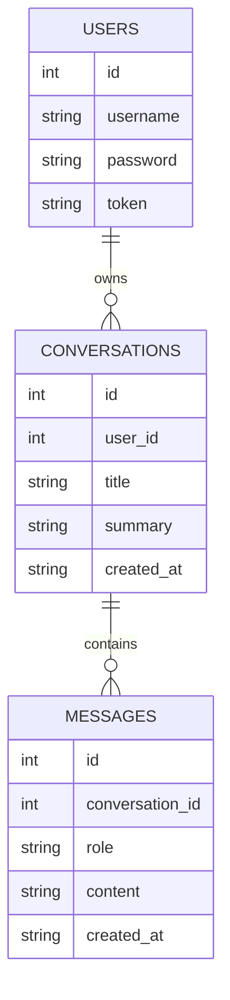

# Backend Workshop

## Setup

```bash
python -m venv venv
```

## Activate


Windows CMD:

```bash
venv\Scripts\activate
```

## Install

```bash
pip install -r requirements.txt
```

## Gemini Key

Copy `.env.example` to `.env` in the project root:

```env
GEMINI_API_KEY=your_key_here
GEMINI_MODEL=gemini-2.5-flash
```

Get the key from Google AI Studio:
- [Google AI Studio](https://ai.google.dev/aistudio)
- [API key setup guide](https://ai.google.dev/tutorials/setup)

## Run

```bash
uvicorn app.main:app --reload
```

## Frontend

```text
Open the frontend from the backend routes, not by double clicking the html files.
Use localhost consistently for login, frontend, and Swagger docs.
```

## Database

```text
The chatbot creates chatbot.db automatically.
```

## Chatbot DB



## Open

```text
http://localhost:8000/
http://localhost:8000/todo
http://localhost:8000/chatbot
http://localhost:8000/chatbot-auth
http://localhost:8000/api-lab
http://localhost:8000/docs
```
